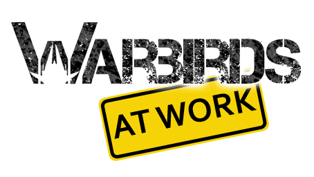


  
After some trouble with the premium subscription to the Creators Club / App Hub, I finally managed to get the release of Warbirds At Work done.
<figure>
  
</figure>
Hopefully there won’t be any major technical difficulties, so that the game will pass the peer-review. More information about Warbirds At Work can be found on the Games page [no longer available].
  
I’d like to thank Ax once again for his support regarding the Graphics.
  
As I am unable to influence the review at the moment, I might as well start the planning for a new game 🙂