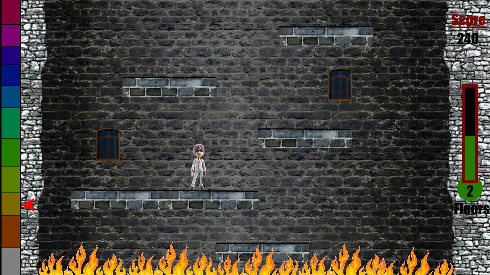


  
I’d like to present you the plans for my next game on the Xbox360. The working title is “Avatar Tower”.
  
The basis for Avatar Tower is the game [IcyTower](http://www.icytower.com/).
  
The player must jump up platforms and ideally do combos (hitting the jump button again at the right time) to gain further points. If he drops beneath the bottom of the screen, the game is over.
  
There will be 10 different environments with 100 steps each (1000 platforms to the top of the tower).
The gamer’s avatar will represent the player character.
  
Yeah, I know, it’s basically a shameless copy of IcyTower, but the game concept is pretty small and fun.
The timing concept differs a little. In IcyTower the player runs against the clock. The clock is reset every 100 steps. If you’re out of time you loose. The timer starts, as you jump on the first platform.
  
In my version your enemy is also time, but it’s represented by flames that are steadily burning upwards.
Okay, the timing concept doesn’t differ that much, but at least you’ll get a nice flaming effect instead of a clock.
  
I made a quick mockup for the game and the HUD. The progress bar on the left shows the current stage the player is in. Most of the game will be 2D, but I try to render the platforms in 3D. We’ll see if that works.
<figure>
  
</figure>
This project will allow me to get familiar with handling Avatars, implementing online highscores (if it is possible at all) and improve my non-existent digital art skills.
  
One big advantage of the small game concept is, that it might be possible to finish the game in 2 month. The deadline is set to the 31.12.10, this will be an enormous challenge.
  
Tomorrow I’m setting up the basic framework for the game, writing the feature list and hopefully get a feeling for the mixture of 2D/3D rendering that I intent to do.