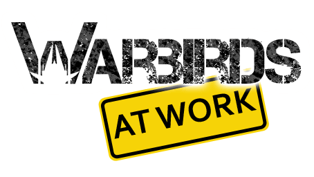


  
I’ve been extremly lazy (regarding game dev) in the last weeks.
  
As a really cool premature christmas present I got notified that WAW has finally passed peer-review and will be published on the marketplace in about 48 hours.
<figure>
  
</figure>
Here is the link to the marketplace: [Warbirds At Work](http://marketplace.xbox.com/de-DE/Product/Warbirds-At-Work/66acd000-77fe-1000-9115-d80258550745) BUY IT! 😀 (or ask gently for a promo code)
  
Hopefully I will find some free time in the christmas holiday for Avatar Tower development.
  
I wish you and your family a merry christmas!