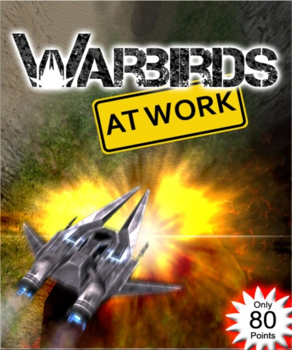
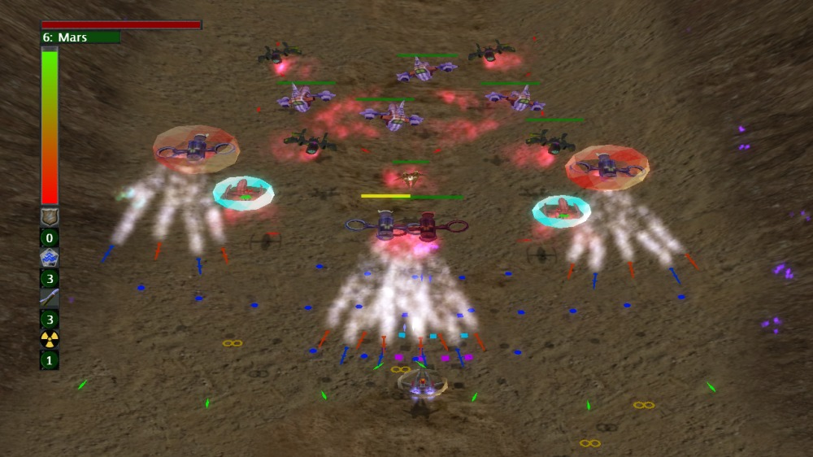
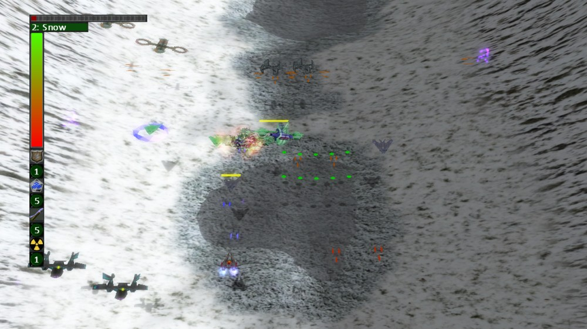
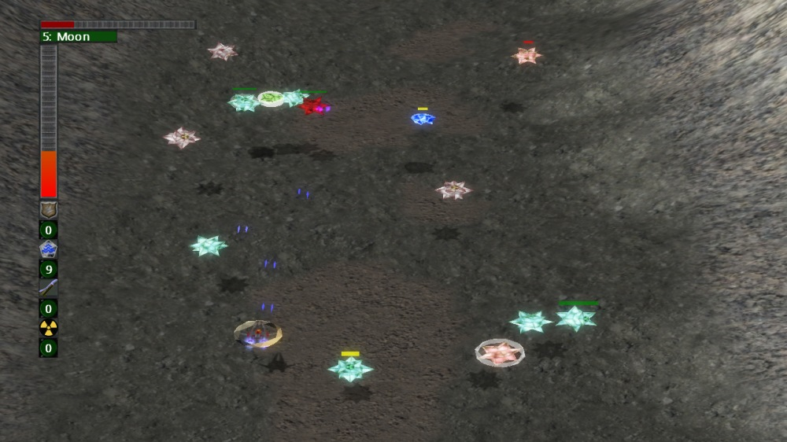
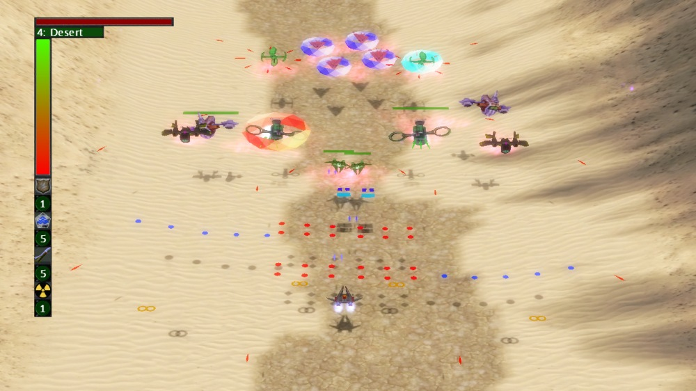


<figure>
  
</figure>
Aliens try to invade the planets of our solar system. You are our last hope, fight them back! Show your fighting skill in various environments and help to save earth in this arcade shooter.

<iframe width="560" height="315" src="https://www.youtube.com/embed/kaZGhKvKphU" frameborder="0" allowfullscreen></iframe>

  
You can buy WAW here: [Warbirds At Work on the Marketplace](http://marketplace.xbox.com/de-DE/Product/Warbirds-At-Work/66acd000-77fe-1000-9115-d80258550745)
  
This is my first release for the Xbox Live Indie Games (done in collaboration with a former colleague – thanks for the graphics Ax!). It is a casual singleplayer shmup that helped me a lot in learning the capabilities of XNA.
  
It provides the following features:

* 7 environments with 7 boss formations
* 7 different powerups
* 24 different enemy variants
* 5 weapons
* endless fun by random level generation

<figure>
  
  
  
  
</figure>