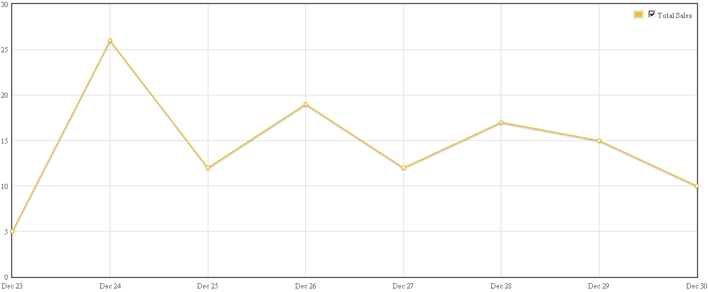


  
Here is the sales data for the first week of Warbirds At Work on the Xbox marketplace:
<figure>
  
</figure>
<b>Period Statistics (23 – 30.12)</b>

* Trials: *1367*
* Purchases: *116*
* Purchase/Trial Ratio: *8.49 %*

I am pleased with the sales so far. As the development and release of WAW was solely a learning purpose, it is nice to see, that a few people actually like the game. The conversion rate is getting better day by day.
  
Still a long way to go, until I can make a living out of this…