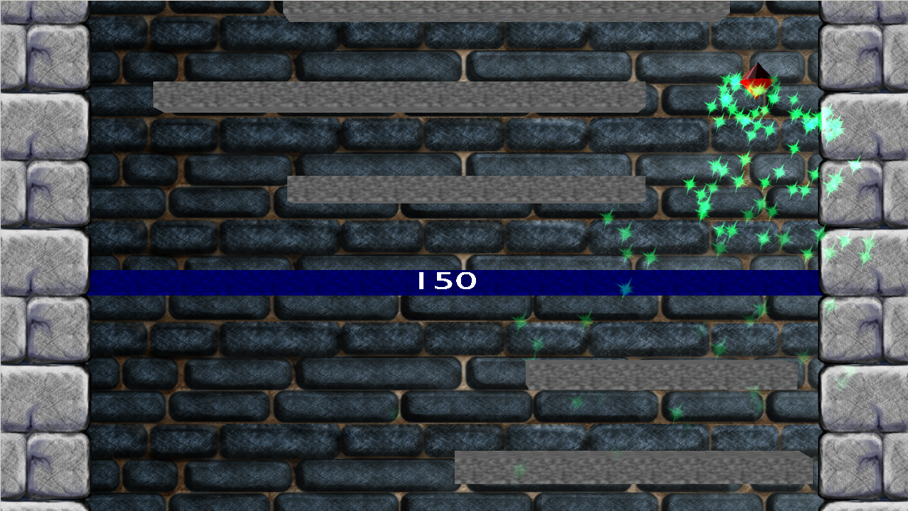


  
Avatar Tower has made some small progress (the 22 to 24 work hour concept did work sometimes). I added some basic particle effects and finally replaced the platforms by models with fixed dimensions. Also the platform level is displayed every 10 steps.
<figure>
  
</figure>
I think about adding enemies to the game, like spiders crawling on the platforms and coins to collect, that add to your score. With the enemy concept one could easily raise the difficulty on higher levels.
  
Shouldn’t take too long to finish this simple game…
  
*Side note*: Raymond Matthews finished his review of Warbirds At Work. See his blog [DarkstarMatryx](http://www.darkstarmatryx.com/?p=185) for the review. Thank you Raymond!