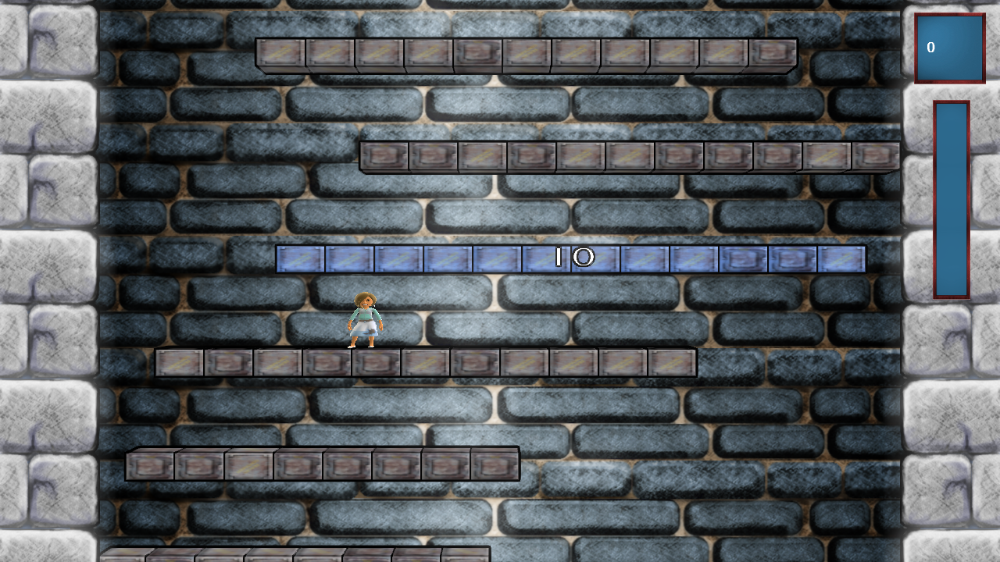


  
I finally managed to reconfigure my development environment in Ubuntu. The linux host will hopefully prevent me from further malware. Visual Studio is running in a Windows XP VM and I deploy the project directly to the Xbox, as the VirtualBox graphics adapter / my physical hardware doesn’t allow XNA/DirectX execution. This setting works quite well, although I have to switch to a full Windows when it comes to memory profiling with the CLR. I’m happy with Ubuntu. It simply works and I have all I need.
  
My work and studies don’t leave much spare time, but I’ll try to invest more time into Avatar Tower in the next weeks. I managed to migrate from XNA Game Studio 3.1 to 4.0 on the last weekend and also added toon shading and a soft bloom effect. The Avatar is also visible, but still missing animations…
<figure>
  
</figure>
At the end of this post I’d like to congratulate [ProjectorGames](http://www.projectorgames.net/) to their huge success [Fortresscraft](http://www.fortresscraft.com/). Who could anticipate that one can make [a lot of money](http://i199.photobucket.com/albums/aa179/HK6/FortressCraftSalesV4.png) on the Indie Games? And why didn’t I have the idea to make a Minecraft clone for the XBox after it made Notch a millionaire?