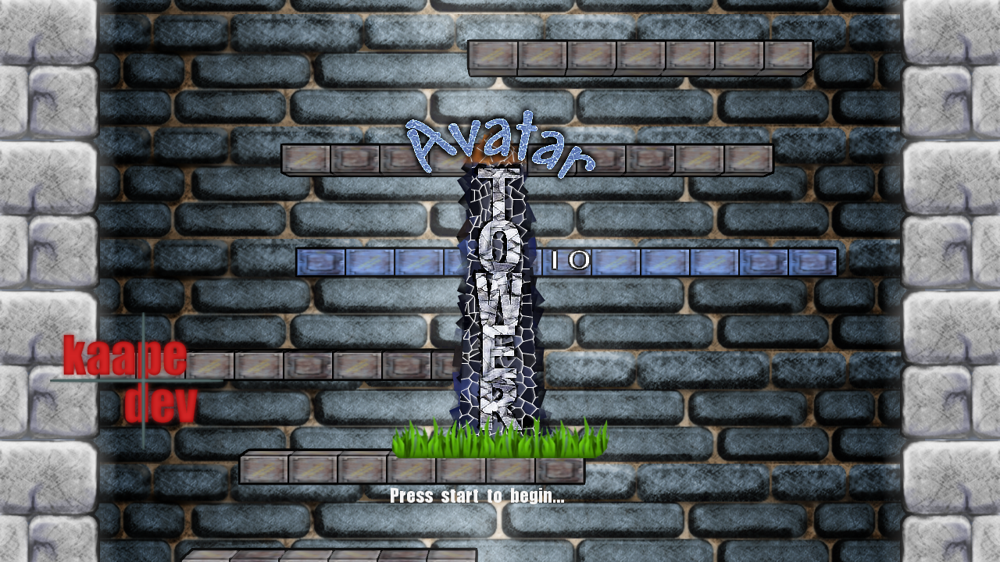
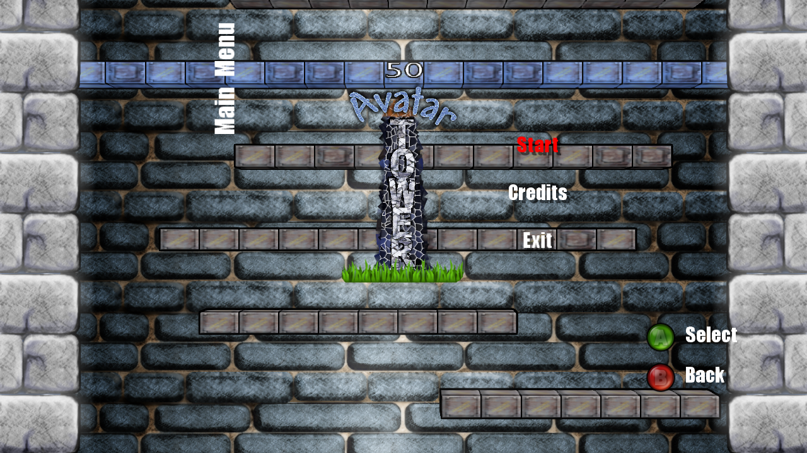
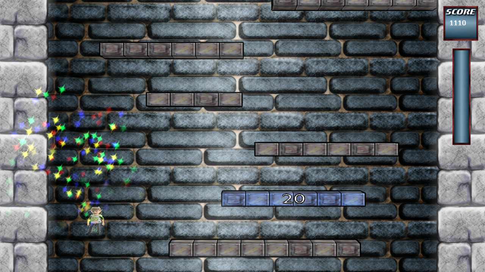


  
After months of wasted time, I finally got my butt in gear and fixed some bugs (ParticleSystem for xna 4.0, buggy collision detection and scrolling) in Avatar Tower and made small progress. The screenshots show the titlescreen, menu and the current ingame state. There is still a lot to do, especially for the game mechanics. I try to get in my old work pattern, working from 22-24 o’clock on the game, perhaps even from 20-24 o’clock, as I have nothing to for my studies until october! My motivation is really pushing me to finish that game.
<figure>
  
  
  
</figure>
As a small side note, I have discovered the game [Luftrauser](http://not.vlambeer.com/luftrauser/). It’s a small aircombat flash game, where you fight enemy airplanes and ships. I really like the simplicity and minimalism of the game. This could be a good starting point for a small 48hr coding weekend, to create an imitation for the xbox indie games with local multiplayer support. We’ll see if this works out during summer time.