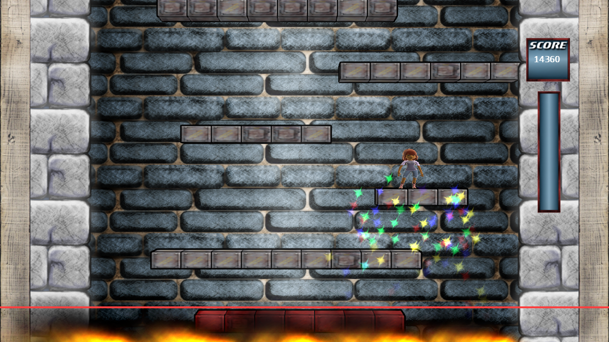


  
You might remember from the early mockup, that I planned to add fire in the bottom of the tower from which the Avatar is trying to flee. Only little help of the particle system was needed to fulfill this requirement. In the screenshot you see the burning fire below the bottom line, that I added as a workaround for the title safe area. I tested the game in various resolutions and needed to add the wooden panels on the left and right too,  as they get cropped away in lower resolutions. This has the added benefit of reducing the tower space and thus emphasising the jumping and bouncing off the walls. As a small visual effect the platforms get “hot” below the line and are coloured red, which means the player cannot stand on them anymore.
<figure>
  
</figure>
Besides these changes I added an advertisement screen for Warbirds At Work in the menue to catch some synergy effect (which is unlikely to work out).
  
Sometimes it happens that you get stuck in air and drop to your inevitable death. In fact, it happens often to me, so I think about adding some dash/boost/dodge action in midair, that slowly refills after use.