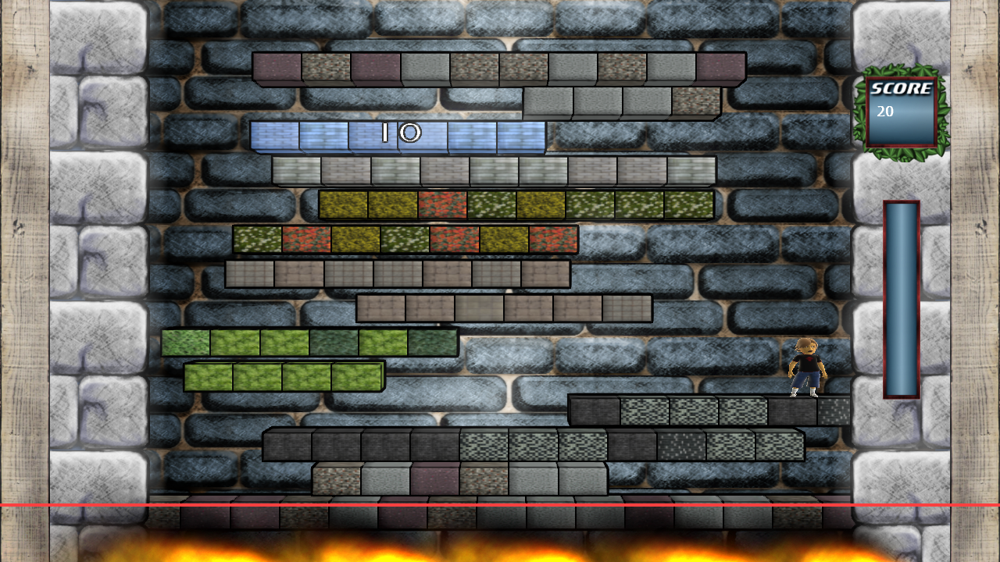


  
A lot of potential “platform theme” texture files have been lying around on my hard disk for some time now. All of them can be found on [cgtextures.com](http://cgtextures.com) which is my preferred resource for photorealistic seamless textures. Today I tested some of them on the platforms and really like the result of the comic shader.
<figure>
  
</figure>
You might also notice the leaves around the scoreboard. The borders between the HUD and the wall behind them are pretty harsh. I tried to weaken them by adding these leaves. They give a new touch to the graphic style that I will extend further to the combometer and also to the combo effect messages, that will pop up when the player finishes a combo.
  
The background is the only element in the game that I don’t like anymore. It doesn’t fit the rest of the screen. I’ll try to come up with a new design quickly.