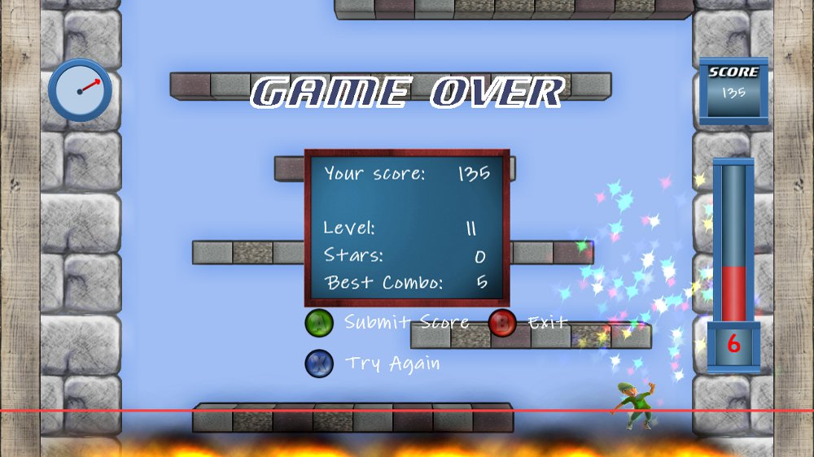
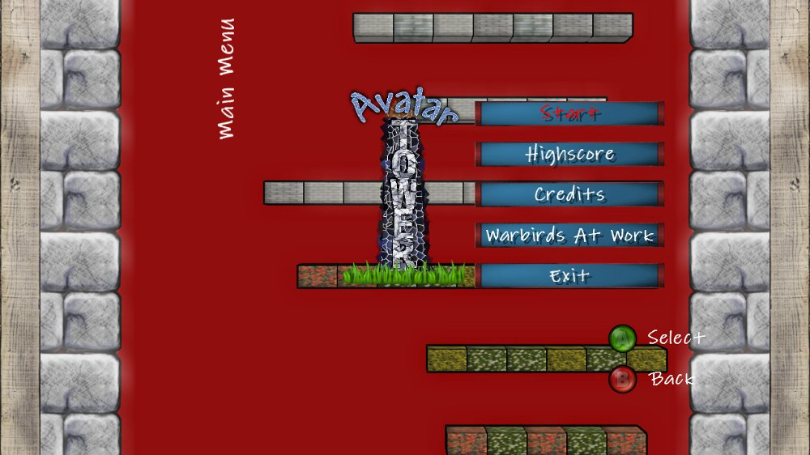
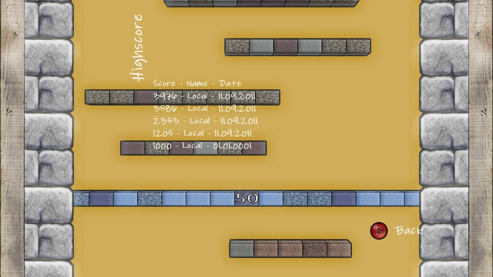
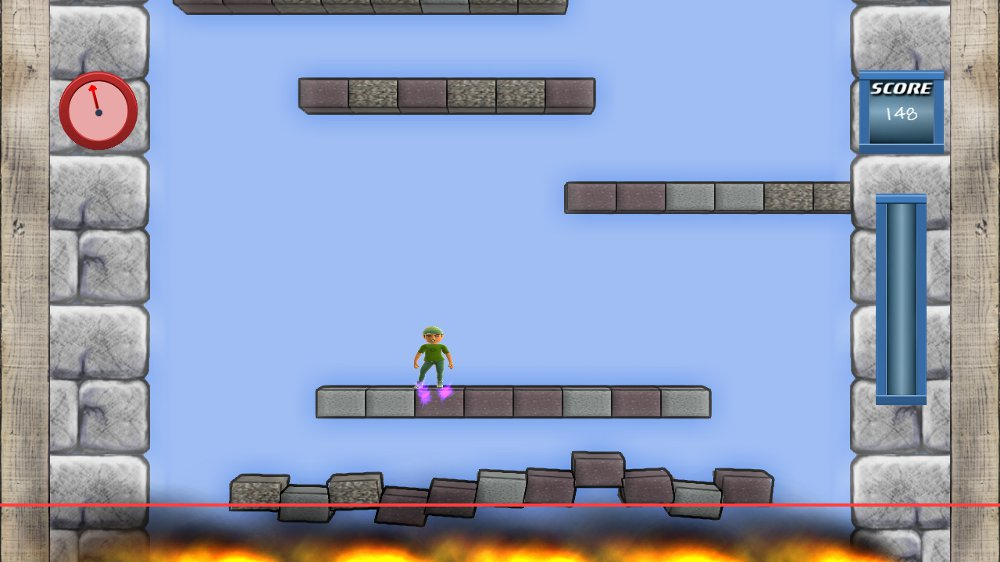


  
I just submitted Avatar Tower for playtest. As my Microsoft Live subscription runs out during the next weeks it might be a good idea to get the game done.
  
During the weekend I implemented all missing features, like combos, timer, breaking platforms, a new background screen (which is just a changing background color), increasing difficulty, highscore, stars to pick up, avatar animations and an adequate Game Over screen. We’ll see how the community values the game. For me it’s a small game for breaks or for younger players, like the original icytower.
  
The (preliminary) release screenshots:
<figure>
  
  
  
  
</figure>