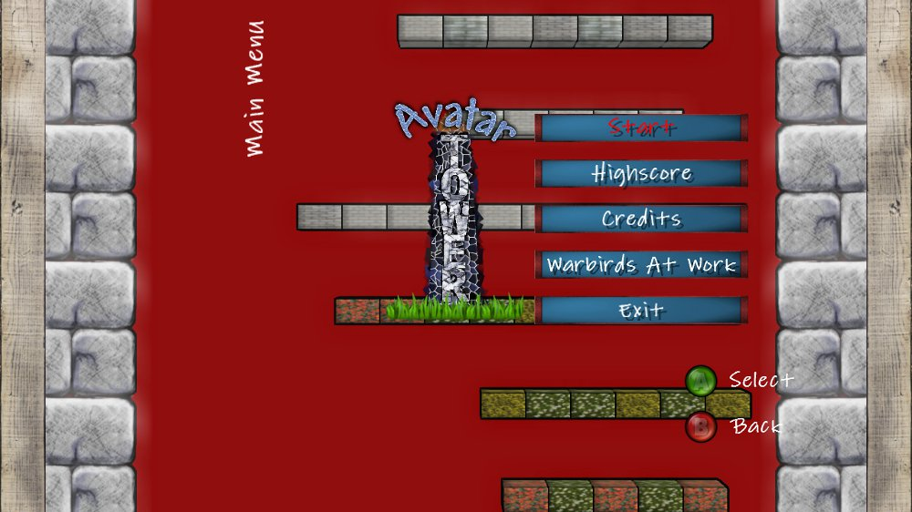
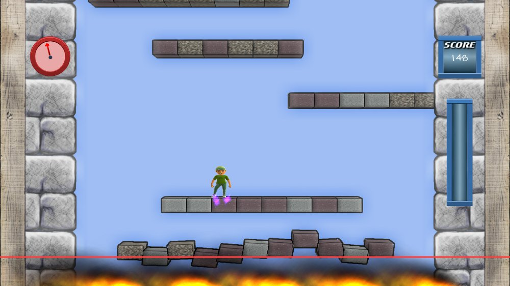


  
Yay! Today I got notified that Avatar Tower hits the marketplace soon.
<figure>
  
</figure>
<b>You can buy Avatar Tower here:</b> [Avatar Tower on marketplace](http://marketplace.xbox.com/en-US/Product/Avatar-Tower/66acd000-77fe-1000-9115-d802585509b7)
  
As my premium subscription of Creators Club runs out during the next weeks, this will be my last project for the Xbox. Although I already started to work on a Luftrauser clone I couldn’t manage to get it finished on time. For my future projects I will probably switch to more general topics, but will still use this blog to spread the word.
  
If you want to review Avatar Tower just contact me, I have some redemption codes to give away for free.
  
Happy playing!
  
<b>Game description:</b>
  
Your Avatar is stuck in a burning tower! Flee from the fire by jumping the platforms. Make combos and collect stars to gain higher scores. Try to break your own highscore!
  
This is my second release for the Xbox Live Indie Games. It is a casual singleplayer arcade game.
  
It provides the following features:

* play with your Avatar
* 10 different platform themes
* 2 powerups
* local highscore
* endless fun by random level generation

<figure>
  
  
  
  
</figure>