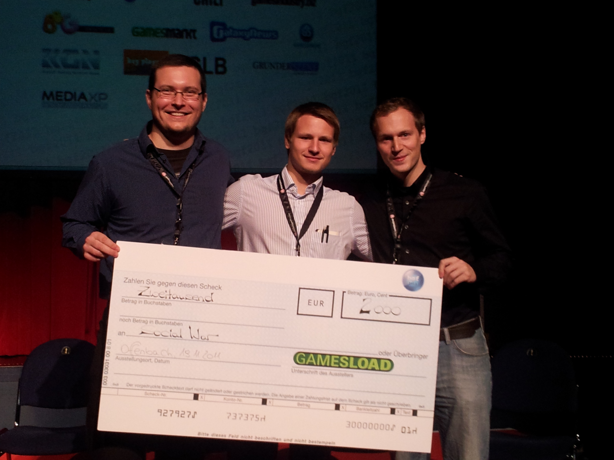


  
The team around “Social War” is bright winner of the bronze medal at the Browsergames Forum Starter Trophy 2011. The Starter Trophy by Gamesload has been awarded within the Browsergames Forum for the first time. The best games or game concepts have been rewarded.

<figure>
  
  <figcaption>bgf Starter Trophy 3rd Place</figcaption>
</figure>

The intense preparation for the event was worth it and has been rewarded with the 3rd place. We had the sparking idea for the game Social War for a while and could develop it for some time. After countless conversations, scrapped sketches and controversial discussions, the Gamedesign document developed step by step. It describes the basic game concepts.
  
With the affirmation and validation of the concept in the course of the Browsergame Forum and the acquired motivation to intensively pursue Social War, we take the step into preproduction.