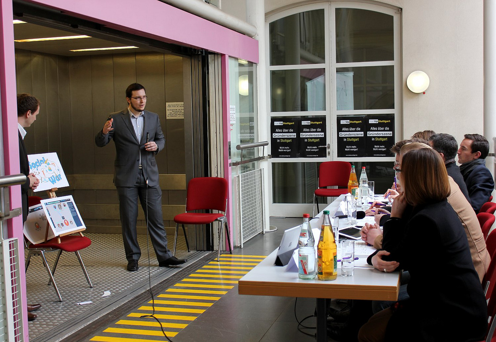


  
We have attended the [Gründerzeit Baden-Württemberg](http://www.gruenderzeit-bw.de/) event on 2nd & 3rd of March and participated with our game idea “Social War” at an Elevator Pitch contest. Altogether 35 teams tried to convince the jury with their business idea.

<figure>
  
  <figcaption>Social War Elevator Pitch Gründerzeit</figcaption>
</figure>

A nice summary report can be found on [Startup-Stuttgart](http://startup-stuttgart.de/featured/elevator-pitch-grunderzeit-bw-2012/).
  
Unfortunately we couldn’t win the jury for our project and therefore haven’t been nominated as finalists. Overall the experience, new contacts and the feedback that we could gain at the event are an important building block for our next steps. To bring our complex game concept into a pitchable summary and highlight the economic potential was a big challenge.
  
This event has shown us, how important it is to shape and present your vision convincingly. Especially if you are reliant on funding this competence is a basic requirement.
  
Here is a recorded Livestream of our pitch and the questions from the jury afterwards:

<iframe style="border: 0; outline: 0;" src="http://cdn.livestream.com/embed/elevatorp?layout=4&amp;clip=pla_9ce406ef-b08f-4c63-9a1e-660bdd0ebbda&amp;height=340&amp;width=560&amp;autoplay=false" frameborder="0" scrolling="no" width="560" height="340"></iframe>

We are around minute 20 on stage. Sadly the audio is asynchronous to the video.
  
Please help us with your comments. 
Where can we improve our presentation? 
Which points of the pitch aren’t comprehensible enough?