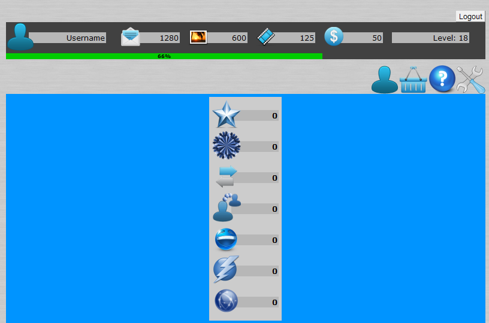
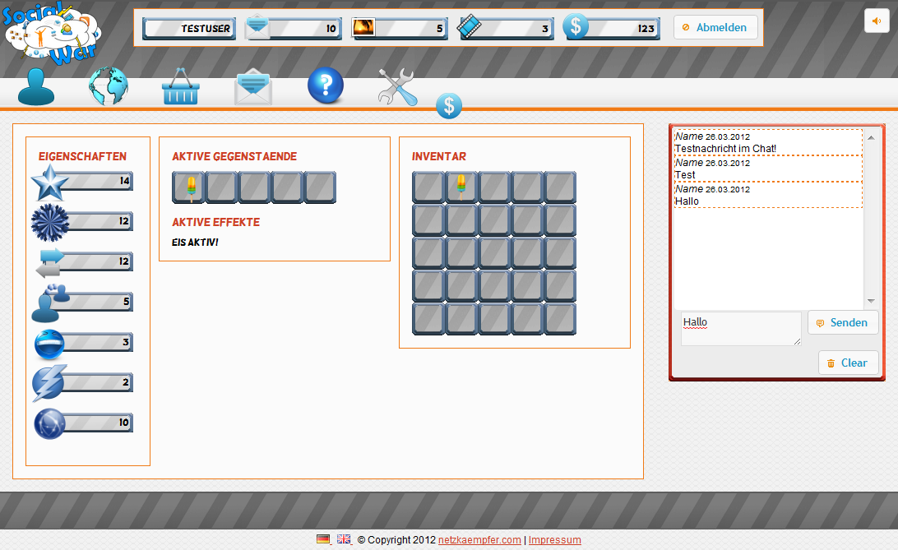


  
After various validations we must proceed to the implementation (at least prototypical) of SocialWar. Therefore we’ve started to choose the proper tools and sharpen them.
Until now we trust in the common setup of Wiki, Trac, Subversion, Jenkins and Eclipse. This combination is a good foundation for the method of working and quality management in our small team.
  
The choice of technologies for the implementation is harder. I could experience personally the advantages and disadvantages of the Google Web Toolkit and created a first prototype:
<figure>
  
  <figcaption>GWT SocialWar Alpha</figcaption>
</figure>
In combination with hibernate a fast prototyping is guaranteed. Weaknesses in the dynamic and visualisation on clientside/frontend (that the screenshot clearly depicts) showed early and thereby the GWT disqualified itself for the usage in our browsergame. With the JSNI one can include native JavaScript, but the separation of code and design is even with the UiBinder cumbersome. It is hard to imagine, how the result of the UiBinder and the View implementation looks. The necessary application server for the GWT RPCs is an additional disadvantage for our small prototype. There must be something easier than that…
  
As an advocate of rich client applications I’m at daggers drawn (without a specific reason) with programming languages like PHP or JavaScript. The experiences of the last weeks have taught me better. Today I proudly claim to be a novice of web development/programming. For an easy entrance in the web development world we have chosen the [Kohana PHP Framework](http://kohanaframework.org/) after a few evaluations. We haven’t regretted the decision yet. The documentation for version 3.2 is a bit weak, but the intuitive usage has convinced me. It simply works – without tinkering or cryptic error messages of the GWT compiler. In combination with jQuery new functionality can rapidly be developed and tested. With the [PHP integration for Jenkins](http://jenkins-php.org/) a clean toolchain is guaranteed, that of course contains unit testing and documentation.
  
The outcome looks a lot more promising, as any of my efforts with the GWT:
<figure>
  
  <figcaption>SocialWar Alpha 27.03.12</figcaption>
</figure>
On the foundation of Kohana, jQuery and CSS we hope to rapidly prototype various gameply elements. The first experiences show potential; we can react on HTML5 and CSS3 and learn a lot about the current state of the art of web technology. What more could a developer want?
  
On to preproduction!