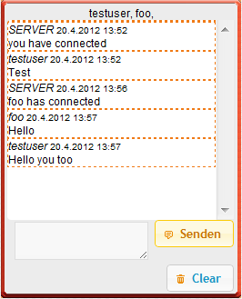


  
Although we choose JQuery and PHP after [intense prototyping](/netzkaempfer-technology-tool-choice) as a foundation for our game, the technology isn’t capable of some functions we need.
  
If you want to send content from a webserver actively to the connected HTTP Clients, you have to go with constant polling. The Websockets protocol provides relief and permits bidirectional connections between web clients and servers.

<figure>
  
  <figcaption>Chat feature</figcaption>
</figure>

A first usage of this feature can be seen in the chat function for Social War. It allows players to chat with their friends, their alliance or all online gamers. For this feature we use Node.js with socket.io, that falls back on Long-Polling or uses Websockets, depending on the abilities of the client.
  
A simple introduction provides [michael mukhin](http://psitsmike.com/2011/09/node-js-and-socket-io-chat-tutorial/).
  
The integration in the PHP and JQuery stack is simple and as Node.js is a separate webserver the module can be developed and maintained independently.
I look forward to implement a fight system, that behaves in “realtime” with Node.js.