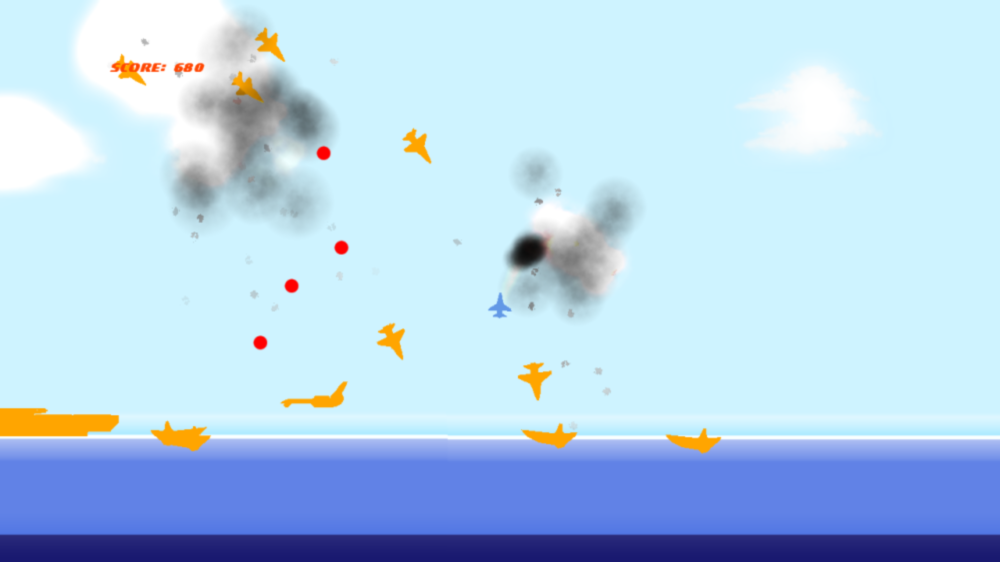


  
During the writing process for my masterthesis I’ve taken up the development of “Airrise” as a balance. As I’ve forgotten to cancel my Creators Club subscription (duh!), I thought that I might as well submit the game to MS Indie Games.
  
Hopefully the playtest period that just started will reveal any major problems. Currently I’m quite happy with the game, as I’m having great fun while playing. Here’s a screenshot of the action:
<figure>
  
</figure>
The effects look more beautiful in realtime and the flight speed isn’t really shown in the screenshot.  I’ll post a gameplay video soon.