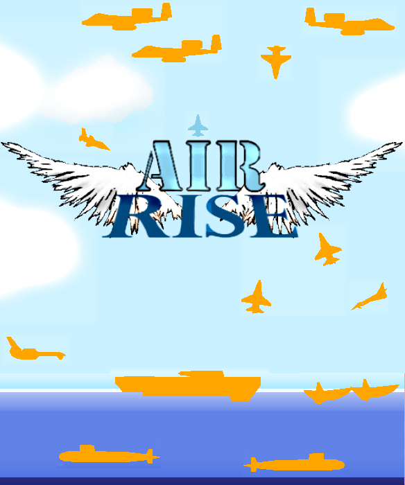
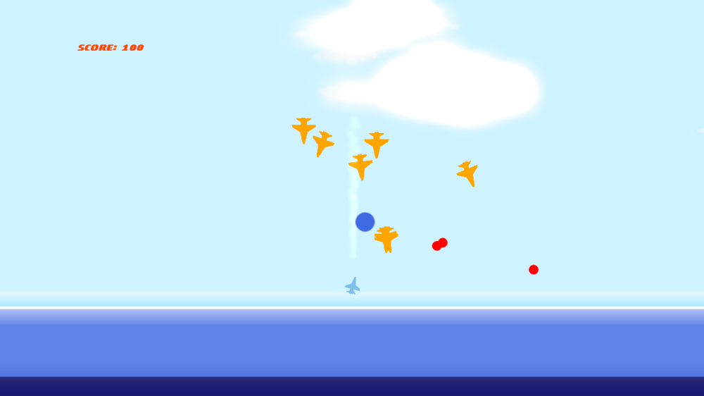


  
Airrise has been released on the XBox Live Indie Games!
<figure>
  
</figure>
As one of the most elite pilots you’ve been invited to test a technologically advanced jet prototype with self-healing capabilities. Try to kill as many enemy drones as possible in this fast-paced air fight simulation. Show them what you’ve got!

<iframe width="560" height="315" src="https://www.youtube.com/embed/mZWfo9FrnX4" frameborder="0" allowfullscreen></iframe>

  
<b>You can buy Airrise here:</b> [Airrise on the Marketplace](http://marketplace.xbox.com/en-us/Product/Airrise/66acd000-77fe-1000-9115-d80258550c11)
  
It provides the following features:

* 7 different enemies
* Increasing difficulty

<figure>
  
  
  
  
</figure>