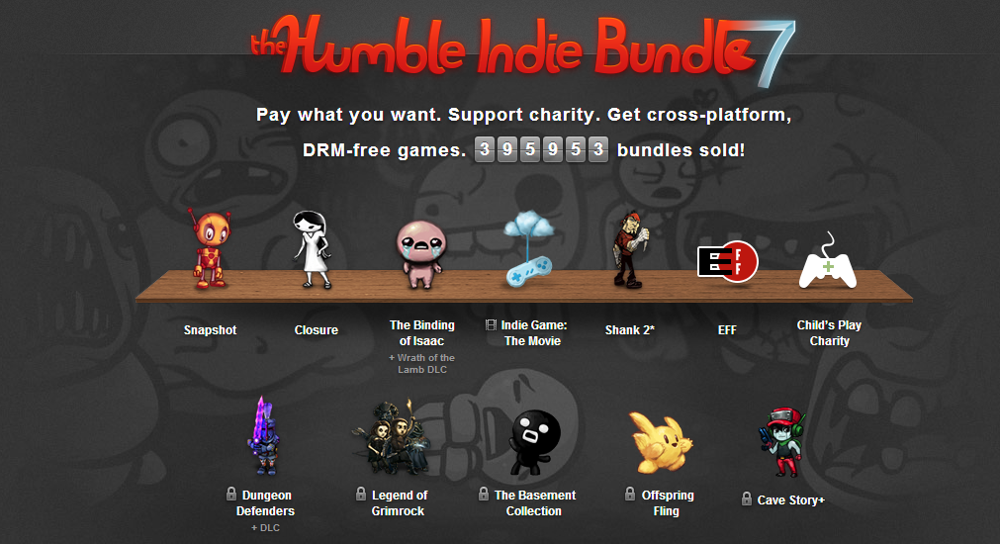


  
During the last years there has been a rise of various new distribution sites for Indie Games and virtual goods in general.
In contrast to that the big developer and publisher [THQ](http://thq.com/) filed for bankruptcy. While this may not be correlated, it shows that there is a big drive from the gamers community to support sole developers or indie teams. Within this market environment there are clearly opportunities for new business models.

<figure>
  
  <figcaption>HumbleBundle</figcaption>
</figure>

The most famous example for a successful new distribution model is the [HumbleBundle](http://www.humblebundle.com/).
Due to their full revenue transparency it can easily be calculated how profitable their “pay-what-you-want” business model is. Sure, they have the most prestigious indie games in their bundles, but in general they have found the solution to a big problem for customers and developers. While the products lifecycle may be on a decline, the HumbleBundle is able to generate a sales peak, which should be pure profit, when the developers hit the break-even on their games. They furthermore expand the developers audience without cost-intense marketing. The customers get entertaining, high-quality games for an unbeatable price, a price that they can choose themselves. The charity support puts the cherry on the cake.
  
There are quite a few other examples that tried to break in the market by winning developers over:

* [Because We May](http://www.becausewemay.com/): A two-week sale driven by indie developers.
* [Indie Games Uprising](http://www.indiegames-uprising.com/): A site created by game developers to advertise their Xbox Live Indie Games.
* [Indie Royale](http://www.indieroyale.com/): Similar to the HumbleBundle with a slightly different “pay-what-you-want” method.
* [IndieGameStand](https://indiegamestand.com/): Focusing on individual games instead of bundles, but also supporting the “pay-what-you-want” method.

Even investors seem to recognize the opportunities in these markets. The [HitFox Group](http://www.hitfoxgroup.com/) focuses on building game companies.
  
A minimal viable product for a game distribution channel should be an easy task.
Reaching the right audience, building a community and winning developers over are hard ones.