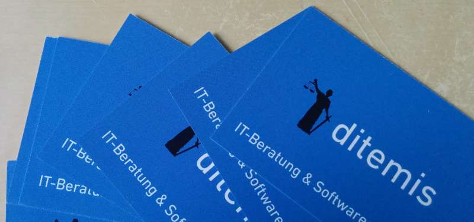

My last "personal" blog post has been on the [17th of October in 2012 on my game development blog](http://kaapedev.wordpress.com/2012/10/17/airrise-release/). It is about the release of my last game [Airrise for the XBox Live Indie Games](/projects/#xbox-live-indie-games-2010---2012). Since then a lot happened. I've finished my studies, worked for a while at a big IT company, finally quit and founded my first company [ditemis](http://www.ditmis.com) in May 2014 (at ditemis we develop individual software solution and provide technical consulting).
With all this happening I've felt the need to start a personal blog.

<figure>
  
</figure>

## My take on entrepreneurship
I'm walking my first steps on the journey from employee to entrepreneur and I'd like you to participate as a reader and learn from my mistakes. Currently I'm working as a freelancer and try to develop various products as side projects. As the content on the [ditemis blog](http://blog.ditemis.com) is addressing german customers in the public sector, I found it more appropriate to talk about my experiences as an entrepreneur on this personal blog. In a few years I'd like to look back at this blog and reread about my transformation into an (hopefully successful) entrepreneur.

## Future content expectations
In the future you'll find a mix of content on this blog. My experiences with growing ideas into business models, used idea validation and marketing methods, used tools, book reviews, personal learnings from startup events like [Startup Weekend](http://startupweekend.org/) and perhaps even revenue reports. With a background in software engineering my projects will mainly focus on Apps, Software-as-a-Service and web-based applications in general.

## Stay connected
If you have any remarks on the content, would like to get in contact (especially if you're in the area of Stuttgart, Germany) or perhaps even need my consultation as a software engineer, don't hesitate to comment or write me an e-mail.
 
 
<a href="mailto:mail@korneliusprell.com" class="btn">Send me an e-mail</a>
