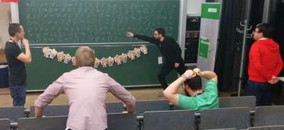
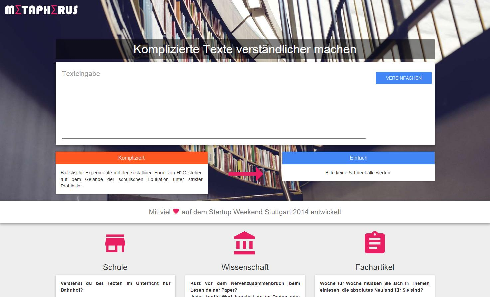

From 21st to 23rd of November I've joined forces with fellow wantrepreneurs and participated in the [Startup Weekend Stuttgart 2014](http://www.up.co/communities/germany/stuttgart/). In this post I'd like to share my experiences from that event with you. There has been some good stuff and there has been some bad stuff. I'll talk about both sides. At the end of the article you'll find a short description of the project and prototype "Metapherus", that I've helped to build.

<figure>
  
  <figcaption>The team "Metapherus" hard at work</figcaption>
</figure>

## An ambitious timeline
The timeline on a Startup Weekend is ambitious to say the least. On friday evening the event started, ideas were pitched and teams were formed. On saturday morning the work began, mentors and coaches helped to refine the idea, a lecture about lean startup methodology and Minimal Viable Product (MVP) were held, the ideas were validated in customer interviews and if possible the development of a prototype was started. On sunday the prototype development continued, a presentation was prepared. On sunday evening each team presented their results, a jury evaluated them and winners in different categories were announced.

It was pretty intense and overall I've spent roughly 39 hours at the event, beginning on friday 5pm and ending on sunday 11pm. With the words of [Johannes Ellenberg](http://johannesellenberg.de/), one of the organisers, "these hours will be the most productive of your life". See for yourself in the following recap video.

<iframe width="560" height="315" src="http://www.youtube.com/embed/1uMzkK3HOTA" frameborder="0"> </iframe>

Almost every team proved that two days are enough to accomplish something presentable. Each final presentation was really well done, even for ideas that had major flaws. For such results to happen, you need a team that is able to get work done and find comfortable roles for each member quickly. From my experience that was the most crucial part and made all the difference in being productive or not.

## The good stuff
I've participated for the first time in a Startup Weekend. Here's what I liked about the event:

* There were a lot of clever, highly motivated and interesting people at the event. It is great for networking and finding like-minded people in your area. It is known as a great place to find a future co-founder.
* The organisation was marvelous. There was plenty of great food, snacks and drinks. Everybody was helpful and in high spirits.
* On sunday evening you're leaving the event with a boost of motivation. I've always liked such events for that effect, as they tend to disrupt your daily work schedule and spark the entrepreneurial enthusiasm again if you've lost it over time.
* The final presentations were on a superb niveau. Each team did a great job on the final presentation, some even found the time to make short videos. For me that was the most impressive thing about the event.
* The event focuses on execution and hands-on experience instead of endlessly searching for brilliant ideas and gaining knowledge through books or lectures
* Our team "Metapherus" won the "most innovative" award :-)

## The bad stuff
I've had some expectations for the event format and the pitched ideas. Some of theses expectations were not met. Here are the things that I disliked:

* A LOT of ideas were pitched. Some had already been done, some were pitched twice or more, some had major flaws and some weren't worthwile to execute in my opinion. I wanted to get inspired by the problems that other people found. I cannot really describe why, but I had the feeling that most pitched ideas weren't "good".
* Only few of the ideas were themed around high-tech products. My impression was, that Startup Weekends should focus on tech-oriented ideas.
* It is difficult to find people with the right skills during team building. Some teams had more than ten members, some had the perfect combination of designers, developers and non-technical persons. A pro tip if you really want to work on an idea: Bring at least one buddy with you that works in a complementary role. That should increase your chances for a well-functioning team.
* The event took place at the [Hochschule der Medien in Stuttgart](http://www.hdm-stuttgart.de/). The work space was mostly open and sometimes difficult to work in due to volume (in return you could see what the other teams were doing and discussing).
* In the end the jury rated a "Minimal Viable Product". There was a strong emphasis on the [Lean Startup methodology](http://theleanstartup.com/). I wouldn't go as far to say that this is a cult, but there are certainly different schools of thought and there is criticism with that methodology. For the event it helped to focus on execution and I have no better solution to rate the results. I'd just like to point out that this methodology doesn't necessarily fit if you're tackling big problems.  
* In terms of business model scalability most ideas failed and didn't fulfill the "classic" startup definition. Although these ideas could work very well as a small business and in a likewise small market, they wouldn't arouse the interest of investors. That isn't necessarily a bad thing, but it didn't match my expectation.
* An award was given for a project that would never work on a large scale and therefore wasn't marketable. Nearly everybody in the audience realized that flaw, which was caused by a strong dependency on the underlying communications infrastructure. The jury seemed to ignore that major flaw.

## Our project Metapherus
The idea generator for our project [Metapherus](http://metapherus.co) was [Cornelius Putzler](http://corneliusputzler.de/), who has worked on a problem during his studies of computer linguistics. In the past he tried to find a way to transform texts that are difficult to understand into easier versions. He pitched this idea and found a team of supporters, including me.

<figure>
  
  <figcaption>The frontend draft for "Metapherus"</figcaption>
</figure>

Although a weekend isn't enough to develop a complete solution for such a broad problem scenario, we tried to find a niche and do a market validation. We basically split the team into a development and a marketing part.

The development team made a prototype with Python that replaced synonyms of words to showcase how the solution might work in the future. A small web frontend was built with [Material Design for Bootstrap](http://fezvrasta.github.io/bootstrap-material-design/bootstrap-elements.html).

The marketing team conducted an online survey adressing students and pupils that had struggled with text comprehension in the past. It validated the need for such a solution and gave us an idea on how to price it. Another customer segment, bloggers and journalists, weren't that interested, so we focused on students for the market entry.

We managed to get a lot of information in a short period of time, validated parts of the idea and got the "most innovative" award. The idea is promising and even captured the interest of an investor. In the long run the value of the solution is defined by the quality of the algorithm. That's why we, as a team, won't follow up on it. [Cornelius Putzler](http://corneliusputzler.de/) will definitely keep on working on his idea.

## Will I do it again?
To summarize the most important part: I had fun. In the end it is only a starting point for ideas and their execution. One shouldn't expect that the results of the weekend will get you far ahead, but perhaps you get to know somebody who will support you on your way.

I'm not sure if I'll participate next year, but if I do, I'll pitch an idea of my own as this should be even more rewarding.