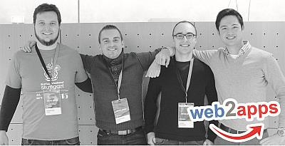
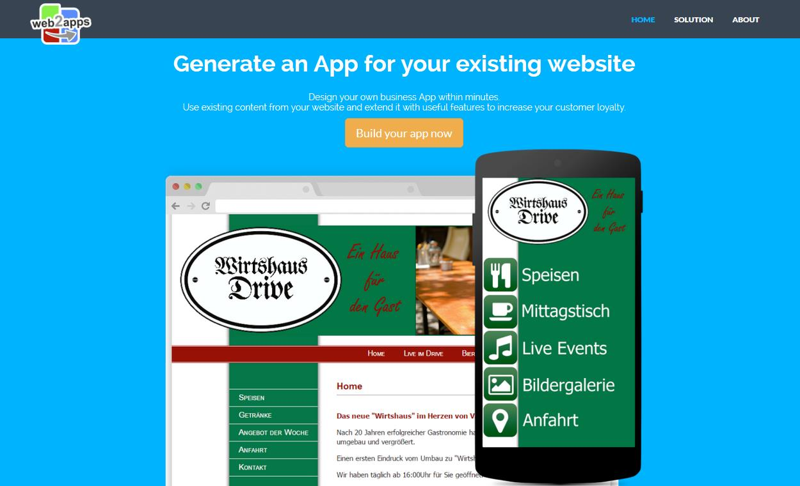

In 2015 I once again joined forces with fellow wantrepreneurs at the [Startup Weekend Stuttgart](http://www.up.co/communities/germany/stuttgart/) and once again I'd like to share my experience from that event with you. If you have no clue what kind of event a Startup Weekend is, I'd suggest you read up on it in [my blog post from last year, in which I've reflected my experience at Startup Weekend Stuttgart 2014](http://korneliusprell.com/startup-weekend-stuttgart-2014/).

<figure>
  
  <figcaption>The team "Web2Apps" posing for the media</figcaption>
</figure>

During 27th to 29th of November 2015 the [Startup Weekend Stuttgart 2015](http://www.up.co/communities/germany/stuttgart/) took place at the [Hochschule der Medien](https://www.hdm-stuttgart.de/). In this post I'll describe the good and bad parts about the event from my point of view. At the end of the article you'll find a short description of the project and prototype "Web2Apps", that I've helped to build. 

To get you in the right mood, here's a [link to a synopsis of the organisators](http://startup-stuttgart.de/das-war-startup-weekend-stuttgart-2015/) and a nice video that summarizes the event:

<iframe width="560" height="315" src="http://www.youtube.com/embed/9i0QwZxzQ3M" frameborder="0"> </iframe>

## The good stuff
With my experience from last your, I adjusted my expectations for the event. With the realigned viewpoint, here's what I liked about the event this time:

* The people partaking were a heterogeneous group with varying skill, but always with high motivation and interesting backgrounds. It is easy to network and find potential co-founders for the future.
* The organisation of the event was again extraordinary. Great food and drinks combined with great staff let the event really shine.
* If you're feeling down from all the workload in your "normal" workplace, you'll leave the event on sunday evening with a boost of motivation. In 2015 I haven't participated in a lot of startup events, hence this was a great way to disrupt my daily work schedule and fuel the entrepreneurial spirit.
* Execution is king. You're constantly reminded of that fact during the event. The organisators and mentors help you gain hands-on experience in idea and market validation. In alignment with the [Lean Startup methodology](http://theleanstartup.com/) the overall target of the weekend is to build your "Minimal Viable Product".
* Our team with four members was small compared to other ones with nearly ten members. As you need to build a functioning team within a short period of time, a small team size is vital. This is certainly different if parts or all of your team have already worked together before.
* We were able to build our private workspace by using some movable walls. In my experience it is essential to have a private area to work efficiently and not constantly be distracted by shenanigans of other participants.
* Our team "Web2Apps" won the "special law price" :-)

## The bad stuff
Unfortunately some of the unpleasent experience from last year has been reconfirmed. This could be in part explained due to my wrong expectations, but nonetheless some of the experience still leaves me unsatisfied. Here are the things that I disliked:

* Last year I've nagged about the quality and quantity of ideas. Unfortunately I have to repeat myself this year. The best ideas spawn from problems that you've experienced yourself. Although most of the pitched ideas tried to address a problem, I could not identify myself with these problems as I've never experienced them. That is not bad in general, but made it hard for me to pick an idea that I could motivate myself for. It didn't help that most of the ideas could not be solved by technology and would be hard to grow beyond a small business. I've changed my expectation that Startup Weekends should focus on tech-oriented ideas, although the event suggests it, as you need to squeeze yourself into the role of designer, tech or non-tech during registration.
* Although the members of the jury changed, the emphasis in the valuation was still questionable. The award for "most innovative" project was given to a team that failed to explain how their technology works, could not show a prototype and didn't even try to validate their business model with the relevant customer segment. One jury member justified the decision with something along the lines of *"Screw it! Even if you could not proof the feasibility, the idea sounds great."*. The event format explicitly emphasises on EXECUTION, not building cloud-castles. Anybody can claim something bold like *"I'll provide space travel for $100 a ticket"*.
* The final presentations last year were on a superb niveau. This year I was a little disappointed by the overall quality of the final presentations.
* Once again it was difficult to find people with the right skills during team building. Developers were in short supply and some teams were too large to work. 

## Our project Web2Apps
The idea for our project [Web2Apps](http://web2apps.co/) was pitched by Waldemar Koch and Christophe Conil, who are both working at their 
startup [FavoTec](http://favotec.com/) and currently build an ERP software that's easy to customize. [Georg Schessler](https://www.xing.com/profile/Georg_Schessler) and myself joined to support them. The initial vision was to create an app generator with which users can easily build their personal mobile app by extracting content from various websites. You can imagine it like your personal dashboard of all the relevant web content you want to follow. As the name suggests we transform arbitrary web content into a suitable form for display in a mobile app. 

After various iterations of brainstorming about possible use cases and business models, we pivoted the idea to help small business owners with an existing website. We wanted to support them by easily generating an app for mobile devices based on their existing website content. A smartphone app would enable them to interact with their customers and e.g increase customer loyalty by push notifications and location-based discounts. 

As a weekend is quite short to build a working business model, we wanted to at least validate this customer segment and build a prototype that shows how our product works for a reference customer.

<figure>
  
  <figcaption>The landing page draft for "Web2Apps" with an example app for the restaurant "Wirtshaus Drive" in Vaihingen</figcaption>
</figure>

We developed a prototype with JavaScript, C++, Qt, QML, Python and Django. A user could select content from a website with the help of a simple DOM explorer and preview it in a Qt desktop client. Qt was used to easily generate cross-platform apps. The server that synchronizes the selected content, design and description of the generated app with the mobile phone was written in Python with Django as the web framework. With this toolset we were able to build a prototype that showed how the app might be used in the future and that the technology to realise the business model is viable.

Next to the development, a big part of our work was to validate the idea with relevant customers. Therefore Waldemar interviewed more than 20 small business owners if their business would benefit from our solution and if they would buy it for our intended price. The results looked very promising, especially for customers in the food service industry as they tend to have simple websites and have the need to increase customer retention.

In the short timeframe of the weekend we managed to validate parts of the idea with a small sample size of customers, build a working prototype and prepare a presentation for the jury. Our hard work earned us the "special law price". As we all think that the idea has potential, we'll follow it up in 2016.

## Will I do it again?
When I ask myself, if the event was worth the time and energy investment, there is an unambiguous answer. I had fun and it was rewarding. There are certainly worse ways to spend your weekends than working on solutions for common problems with a highly motivated team, in a supporting environment with great food and drinks.

If possible, I'm going to participate next year as well... perhaps this time at last with an idea of my own.