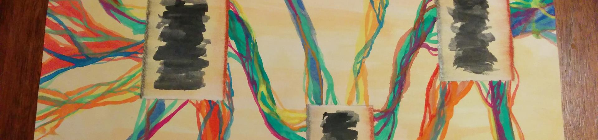
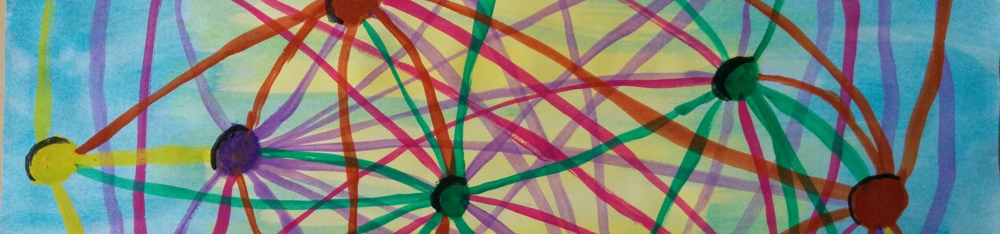
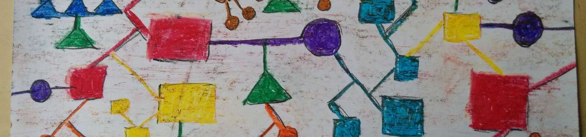
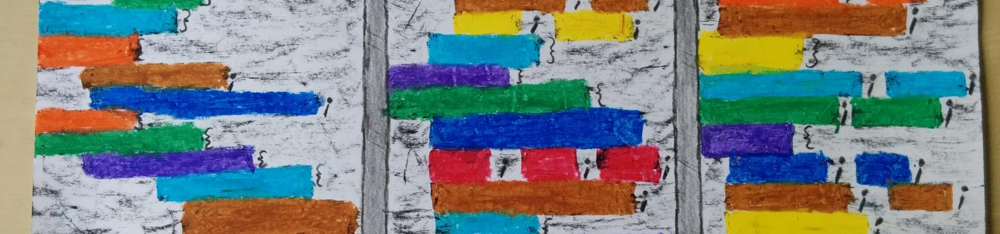

<section id="table-of-contents" class="toc">
  <header>
    <h3>Overview</h3>
  </header>

*  Auto generated table of contents
{:toc}

</section><!-- /#table-of-contents -->

As a balance to my daily life as a software engineer I've recently started to draw abstract pictures of the thought process and feelings that I've experienced during programming. During my last years in high school I've had a habit of sketching portraits and nude studies, that I'll try to readopt with this "Code Art".

## Module Network, 14.03.15

<figure>
  
  <figcaption>Connections between modules form a network. They tend to get fuzzy over time in software.</figcaption>
</figure>

---

## Spaghetti Code, 31.12.14

<figure>
  
  <figcaption>It starts with a single connection between modules. If the solution isn't designed properly these connections get out of control after a while.</figcaption>
</figure>

---

## Fuzzy Connections, 06.12.14

<figure>
  
  <figcaption>Sometimes you see the connections between modules in a fuzzy way. It is not clear what and how it works together.</figcaption>
</figure>

---

## Tunnel to Cursor, 30.11.14

<figure>
  
  <figcaption>Your focus lies on the cursor. You pass various layers through a visual tunnel to reach it.</figcaption>
</figure>

---

## Component Diagram, 20.09.14

<figure>
  
  <figcaption>When designing solutions one often tries to define layers of abstraction and isolate reusable components. In a tetris-like manner these components are moved around and connected with interfaces to build a bigger picture.</figcaption>
</figure>

---

## Code Columns, 06.09.14

<figure>
  
  <figcaption>During frontend work I'm currently using a three column layout. This helps to see connected sections in HTML, CSS and JavaScript.</figcaption>
</figure>

---

## Thought Statements, 30.08.14

<figure>
  
  <figcaption>A lot of unwritten statements, that float around in your head, are needed to solve a problem. Only a few of theses statements are worthwhile to be written done and compiled.</figcaption>
</figure>

---

## Stack of Terminals, 23.08.14

<figure>
  
  <figcaption>Beginning with the main entry point in your code you build a stack of terminals to drill down to the one statement that you're searching for. With each level of depth the picture becomes clearer and the statements become fewer.</figcaption>
</figure>

---

## Statements in Brackets, 19.08.14

<figure>
  
  <figcaption>Between brackets you'll find statements. You'll write a lot of brackets and a lot of statements in your life. You'll create a new world with them.</figcaption>
</figure>