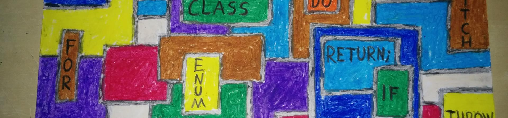
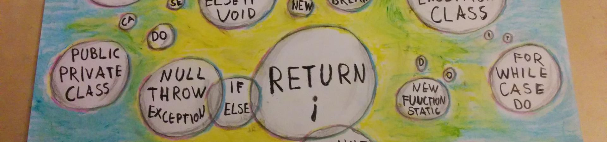
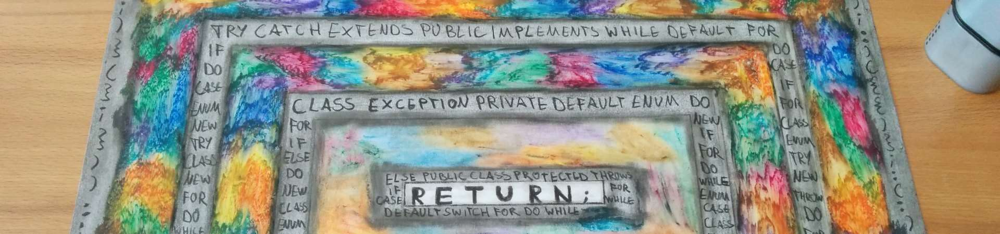
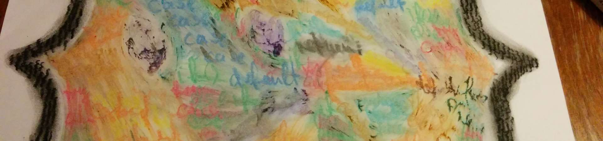

<section id="table-of-contents" class="toc">
  <header>
    <h3>Overview</h3>
  </header>

*  Auto generated table of contents
{:toc}

</section><!-- /#table-of-contents -->

As a balance to my daily life as a software engineer I've recently started to draw abstract pictures of the thought process and feelings that I've experienced during programming. During my last years in high school I've had a habit of sketching portraits and nude studies, that I'll try to readopt with this "Code Art".

## Component Diagram, 20.09.14

<figure>
  
  <figcaption>Component Diagram</figcaption>
</figure>

---

## Code Columns, 06.09.14

<figure>
  
  <figcaption>Code Columns</figcaption>
</figure>

---

## Thought Statements, 30.08.14

<figure>
  
  <figcaption>Thought Statements</figcaption>
</figure>

---

## Stack of Terminals, 23.08.14

<figure>
  
  <figcaption>Stack of Terminals</figcaption>
</figure>

---

## Statements in Brackets, 19.08.14

<figure>
  
  <figcaption>Statements in Brackets</figcaption>
</figure>