<section id="table-of-contents" class="toc">
  <header>
    <h3>Overview</h3>
  </header>

*  Auto generated table of contents
{:toc}

</section><!-- /#table-of-contents -->

This is a curated list of my mentionable side projects from the past and also ongoing ones. It's a nice chronic of the past 10 years with my progression from game programming as a starting point to web programming and a more specialized industry theme. Most of the projects from my professional career as an employee aren't listed for obvious reasons.

## ditemis, 2014

I am the founder of and developer at <a href="http://www.ditemis.com" target="_blank">www.ditemis.com</a>. It is my first serious business venture and was founded in May 2014.

<figure>
  
  <figcaption>ditemis Logo</figcaption>
</figure>

We accompany the public administration on its way to technological and digital change. We provide solutions for any topic around electronical file management. We are mainly working with Java in the backend and JavaScript in the frontend to implement web-based solutions.

The two products Runway and Papierflieger are currently in our development focus.

### Runway, 2014

Runway is motivated by my constant pain as a developer of batch processes. Our customers typically have hundreds of specialized applications that need to interchange data without a standardized interface. In our typical solution architecture batch processes are used to let these applications exchange data by e.g. identifying, validating and converting. Although batch processes are handy for asynchronous, long-running, resource-intense tasks and loosely coupling applications as well, there are quite some disadvantages from a development point of view.

Runway helps system integrators, IT operations and developers with easy batch processing and monitoring so that you stay on top of things. It uses the [JSR 352](https://jcp.org/en/jsr/detail?id=352), the Java Batch API, as a foundation. There are various extensions and helpers that should ease the batch development and monitoring in a productive environment.

You can read more about Runway on its dedicated website [batch-runway](http://www.batch-runway.com/).

<figure>
  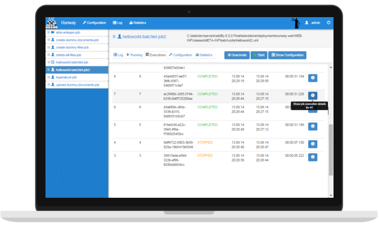
  <figcaption>Runway Global Configuration</figcaption>
</figure>

### Papierflieger, 2013

At my last employment I've worked as a technical consultant in Enterprise Content Management for customers in the public sector. In that role I've worked with and seen various solutions for electronical file management. Most of these products and their development roadmap are directly driven by individual customer projects. This entails that a lot of these "standard" solutions are extremly complex, monolithic, hard to integrate and hard to extend with custom code. Good solutions for mobility use cases are also hard to find.

Before 2012 the german government provided complex guidelines with an extensive requirement catalogue, that eletronical file management products needed to implemnt. The mentioned products adressed these extensive requirements and became too complex to be used on a small scale. In 2012 these government guidelines were revised with a version that promoted simple, manageable products - various big failed projects made them rethink the status quo. That's were we saw an opportunity to break into this market and build a product to help the government with its target to replace paper-based solutions with electronical ones for each federal ministry by 2020. That's when the project "Papierflieger" was born.

Papierflieger is an intuitive, lean and easy extensible product for electronical file management. It uses a content repository ([Modeshape](http://modeshape.jboss.org/)) in the data layer so that any real world scenario in the context of file management can easily be described. You can read more about it here [ditemis Papierflieger](http://www.ditemis.com/papierflieger)

<figure>
  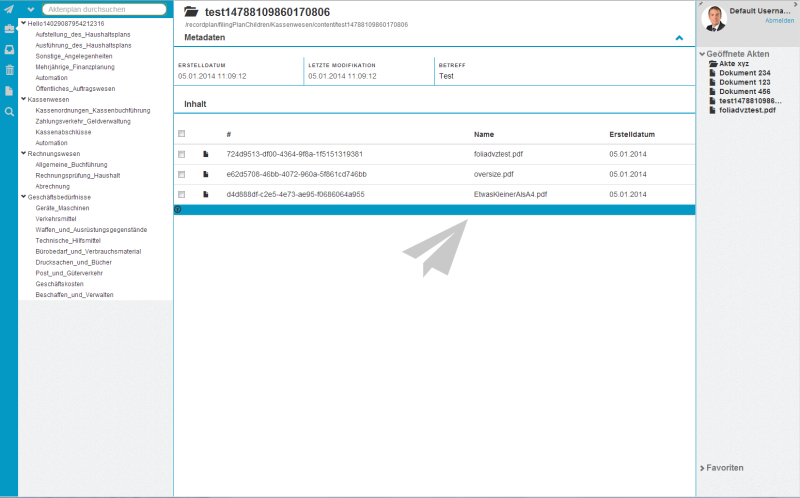
  <figcaption>Early Papierfliege User Interface Design</figcaption>
</figure>

---

## Indie Games for PC, 2013

I'm a big fan of the [Humble Bundle](https://www.humblebundle.com/) as a customer and likewise as an entrepreneur. The business model is simple and it works really well. With "[Indie Games for PC](http://igfpc.herokuapp.com/)" (IGFPC) I've tried to use this model for a smaller niche: games from the Xbox Live Indie Games that have been ported to PC. 

As I already had two finished games (Warbirds At Work & Airrise) in the XBLIG marketplace, 
that could easily be ported to the PC this was an idea to add another distribution channel. If I had this problem, perhaps other developers on the XBLIG experienced the same problem and would benefit from an ecommerce solution like that.

It was a great experience to develop an ecommerce solution from scratch with a somewhat "Pay what you want" model. Although in the end the financial feasibilty wasn't good enough, I've learned a lot. The biggest practical problem was handling the microtransactions and the large percentage of payment provider fees.

<figure>
  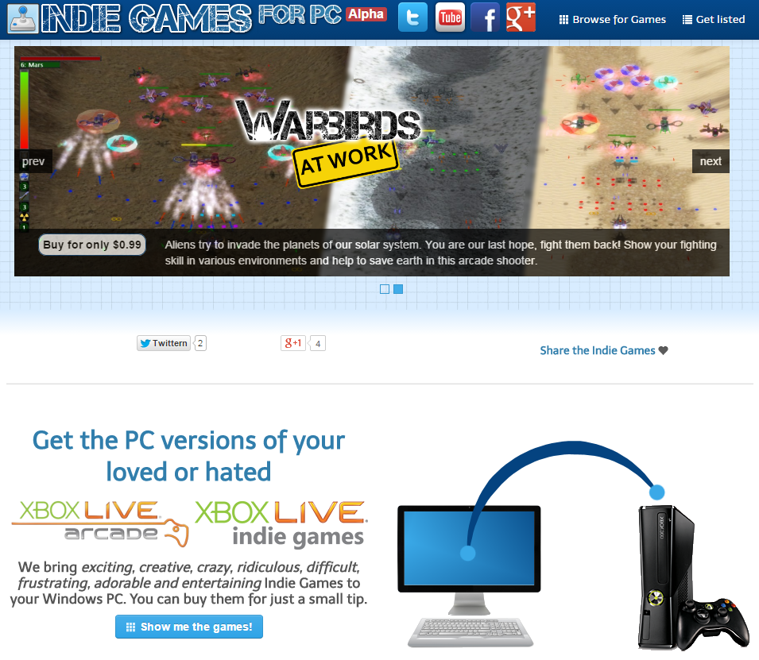
  <figcaption>IGFPC Landing Page</figcaption>
</figure>

<figure>
  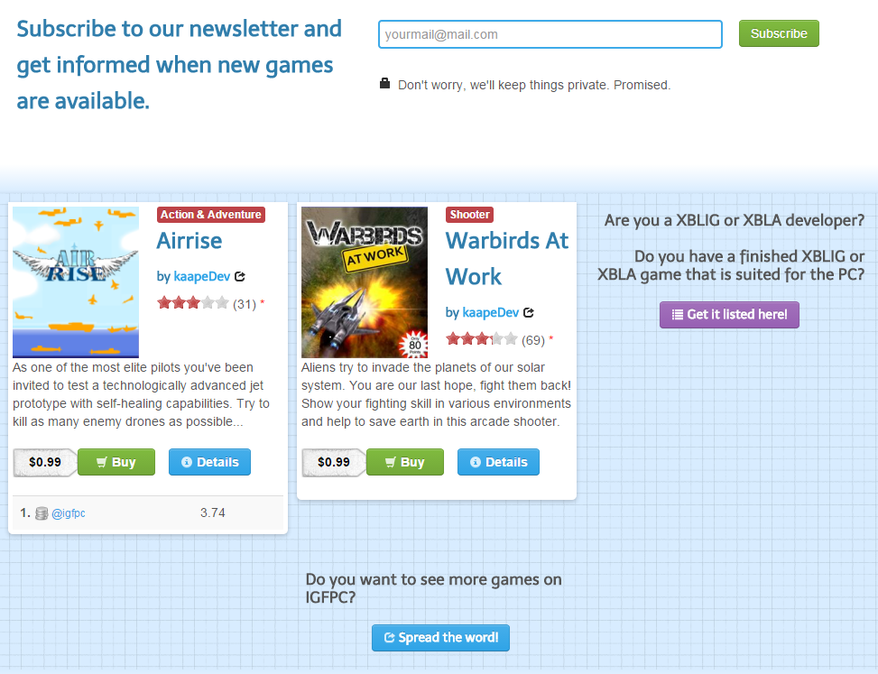
  <figcaption>IGFPC Games Overview</figcaption>
</figure>

---

## Netzkämpfer, 2012

The organisation with the german name "Netzkämpfer" (english: net warriors) was used for promoting the browsergame "Social War". It was my first noteworthy web presence and a first step towards founding a small business.

<figure>
  
  <figcaption>Netzkämpfer Logo</figcaption>
</figure>

### Social War, 2011

Social War was a game concept that paved my path from game to web programming. Inspired by the huge growth of the online-gaming market some colleagues and I developed the concept for this browsergame. We participated in the "Browsergames Forum Starter Trophy 2011" and placed third.

We started the development of a prototype with PHP, but quickly lost motivation. You can read more about [Social War in the migration announcement](/netzkaempfer-migration).

<figure>
  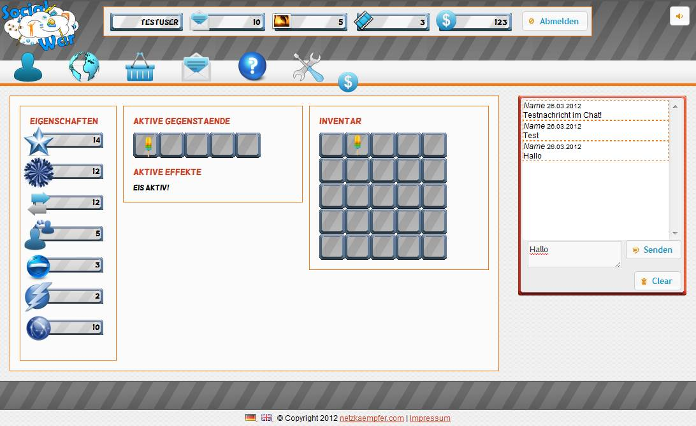
  <figcaption>Social War - Alpha 27.03.12</figcaption>
</figure>

<figure>
  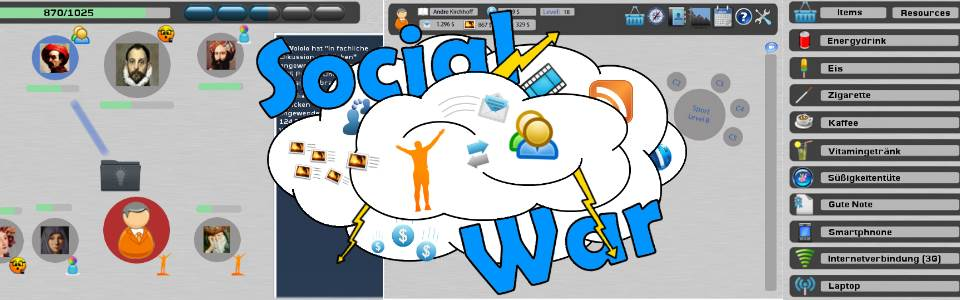
  <figcaption>Social War - Mockup Mashup</figcaption>
</figure>

---

## Xbox Live Indie Games, 2010 - 2012

After experimenting with [XNA](http://en.wikipedia.org/wiki/Microsoft_XNA) I focused on the Xbox 360 as the target platform for my games. I never really published anything until then, so the [Xbox Live Indie Games (XBLIG)](http://en.wikipedia.org/wiki/Xbox_Live_Indie_Games) were a great way to start. I've documented the development process on the separate blog kaapedev.wordpress.com back then; meanwhile migrated all posts into this blog.

After four years since my first game release on the XBLIG I recently hit the small milestone of 1000$ in revenue (~1400 games sold). Although this isn't a big financial success, I learned a valuable lesson in working with digital products. There are currently no costs for me to maintain the product, but there are still a few sales each month.

### Airrise, 2012

After playing [Luftrauser](http://www.vlambeer.com/2011/06/27/luftrauser/) by [Vlambeer](http://www.vlambeer.com/) for the first time, I've felt the urge to build a homage. Airrise is the result.

It isn't the strongest seller but in my point of view it is my best work yet regarding code, graphics and gameplay. 

You can buy Airrise here: [Airrise on the Marketplace](http://marketplace.xbox.com/en-us/Product/Airrise/66acd000-77fe-1000-9115-d80258550c11)

<iframe width="560" height="315" src="http://www.youtube.com/embed/mZWfo9FrnX4" frameborder="0"> </iframe>

<figure class="third">
  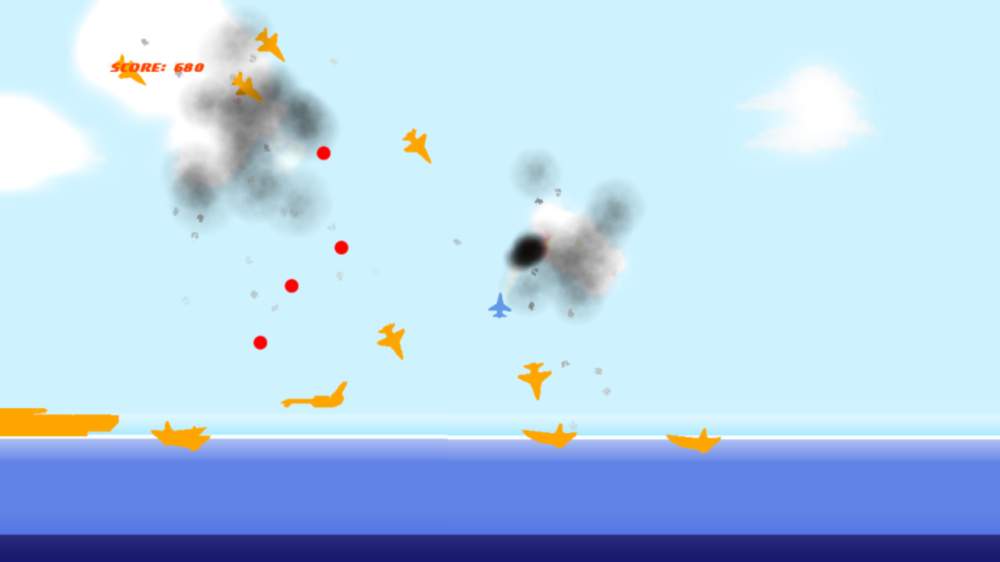
  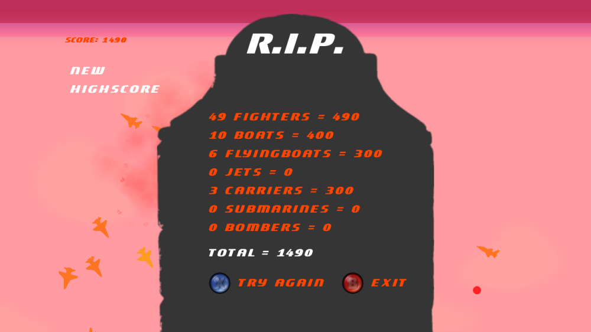
  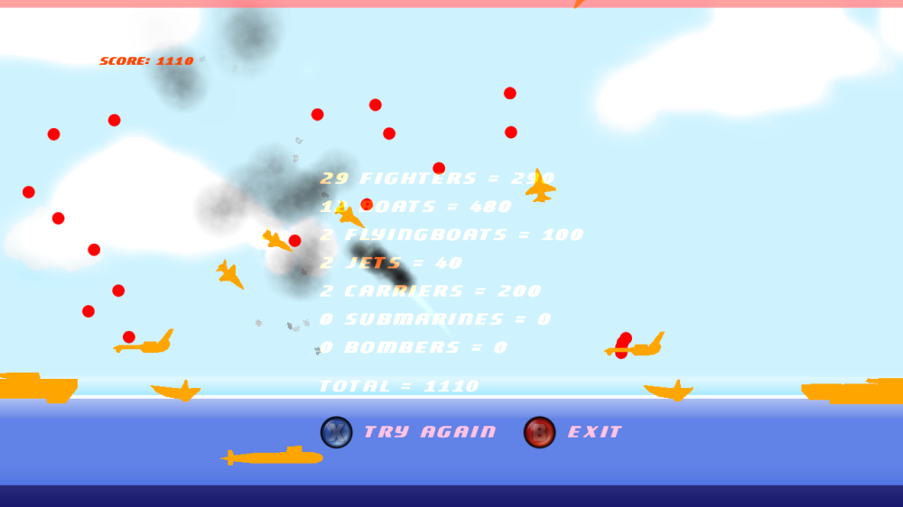
  <figcaption>Airrise screenshots</figcaption>
</figure>

### Avatar Tower, 2011

This is my second release for the Xbox Live Indie Games. It is a casual singleplayer arcade game. It is inspired by [Icy Tower](http://www.icytower.com/).

You can buy Avatar Tower here: [Avatar Tower on the Marketplace](http://marketplace.xbox.com/en-US/Product/Avatar-Tower/66acd000-77fe-1000-9115-d802585509b7)

<figure class="third">
  
  
  
  <figcaption>Avatar Tower screenshots</figcaption>
</figure>

### Warbirds at Work, 2010

This was my first release for the Xbox Live Indie Games. It is a casual singleplayer shmup that helped me a lot in learning the capabilities of XNA.

You can buy WAW here: [Warbirds At Work on the Marketplace](http://marketplace.xbox.com/de-DE/Product/Warbirds-At-Work/66acd000-77fe-1000-9115-d80258550745)

<iframe width="560" height="315" src="http://www.youtube.com/embed/kaZGhKvKphU" frameborder="0"> </iframe>

<figure class="third">
  
  
  
  <figcaption>Warbirds at Work screenshots</figcaption>
</figure>

---

## PC games, 2003 - 2006

As a teenager I started programming in C++. These first steps were hard, especially considering that C++ isn't exactly a language you would recommend for a beginner without an internet connection. My first programs were small game clones. As my experience grew the scope of the games grew. My proudest achievements from that time are "BurnyWing" and "ZombieSchool". I used the nickname "BurningLegend" back then, which explains why most of the game names contain "Burny".

### ZombieSchool, 2006

A major milestone in my game development "career" was ZombieSchool. It has taught me a valuable lesson in version control systems and reliable backup. After a disk crash nearly all of the project was lost. Only the sources for the website of the game could be restored.

It was a multiplayer only, cooperative, top-down shooter. As a team you had to defend yourself from an invading horde of zombies with a lot of different weapons. Think of "Left 4 Dead" with 2d graphics and a top-down view.

The game was written in C++ with various libaries. A map editor and the server control program was written with [wxWidgets](https://www.wxwidgets.org/). For networking the [ZoidCom library](http://www.zoidcom.com/) was used. [Haaf's Game Engine](http://hge.relishgames.com/) was utilized for graphics and input management.

<figure>
  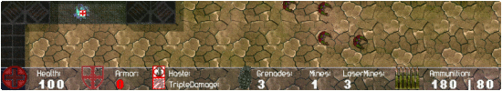
  <figcaption>Everything that is left of ZombieSchool is the banner of the old website</figcaption>
</figure>

### BurnyWing, 2004

Shoot 'em ups have always been a genre that I'd liked to play. So it should be expected that my first major game was a shmup. This was also the first time that I needed to develop tools to help with content creation. In the case of "BurnyWing" I developed a map editor. Like in my earlier games I've used [SDL](http://www.libsdl.org) for input, graphics and window management.

<figure>
  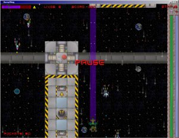
  <figcaption>BurnyWing in action</figcaption>
</figure>

<figure>
  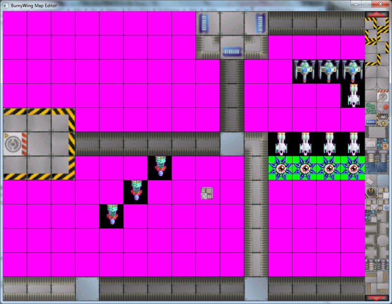
  <figcaption>Custom map editor for BurnyWing. On the right you select a tileset or enemy.</figcaption>
</figure>

### Various game clones, 2003 & 2004

The first fully playable games that I made were clones of "Connect Four", "TicTacToe", "Snake", "Tetris", "Breakout", "Minesweeper" and "Sokoban".
All of them used [SDL](http://www.libsdl.org) as a way to easily draw images, react to keyboard and mouse events and manage the window.

<figure class="third">
  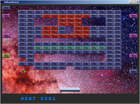
  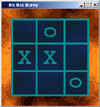
  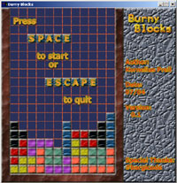
  <figcaption>Arkanoburny, BicBacBurny, BurnyBlocks</figcaption>
</figure>

 
Who says you can't build pretty console graphics with C++?

<figure class="third">
  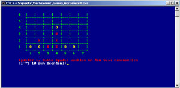
  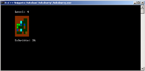
  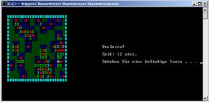
  <figcaption>Connect Four, Sokoburny, Burnsweeper</figcaption>
</figure>