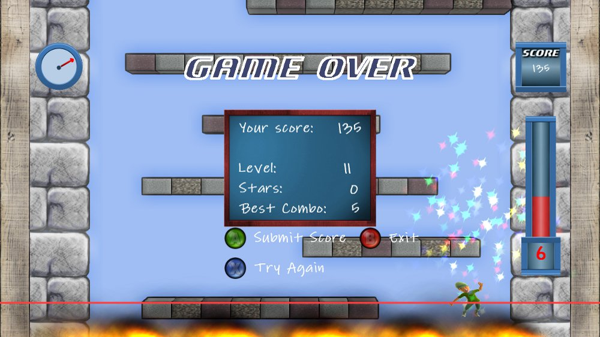

<section id="table-of-contents" class="toc">
  <header>
    <h3>Overview</h3>
  </header>

*  Auto generated table of contents
{:toc}

</section><!-- /#table-of-contents -->

This is a curated list of my mentionable side projects from the past and also ongoing ones. It's a nice chronic of the past 10 years with my progression from game programming as a starting point to web programming and a more specialized industry theme. Most of the projects from my professional career as an employee aren't listed for obvious reasons.

## ditemis, 2014

I am the founder of and developer at <a href="http://www.ditemis.com" target="_blank">www.ditemis.com</a>. It is my first serious business venture and was founded in May 2014.

 
We accompany the public administration on its way to technological and digital change. We provide solutions for any topic around electronical file management. We are mainly working with Java in the backend and JavaScript in the frontend.

The two products Runway and Papierflieger are currently in our development focus.

### Runway, 2014

TODO

### Papierflieger, 2013

TODO

---

## Indie Games for PC, 2013

TODO

---

## Netzkämpfer, 2012

TODO

### Social War, 2011

TODO

---

## Xbox Live Indie Games, 2010 - 2012

After experimenting with [XNA](http://en.wikipedia.org/wiki/Microsoft_XNA) I focused on the Xbox 360 as the target platform for my games. I never really published anything until then, so the [Xbox Live Indie Games (XBLIG)](http://en.wikipedia.org/wiki/Xbox_Live_Indie_Games) were a great way to start. I've documented the development process on the separate blog [kaapedev.wordpress.com](http://kaapedev.wordpress.com) back then.

After four years since my first game release on the XBLIG I recently hit the small milestone of 1000$ in revenue (~1400 games sold). Although this isn't a big financial success, I learned a valuable lesson in working with digital products. There are currently no costs for me to maintain the product, but there are still a few sales each month.

### Airrise, 2012

After playing [Luftrauser](http://www.vlambeer.com/2011/06/27/luftrauser/) by [Vlambeer](http://www.vlambeer.com/) for the first time, I've felt the urge to build a homage. Airrise is the result.

It isn't the strongest seller but in my point of view it is my best work yet regarding code, graphics and gameplay. 

You can buy Airrise here: [Airrise on the Marketplace](http://marketplace.xbox.com/en-us/Product/Airrise/66acd000-77fe-1000-9115-d80258550c11)

<iframe width="560" height="315" src="http://www.youtube.com/embed/mZWfo9FrnX4" frameborder="0"> </iframe>

<figure class="third">
  
  
  
  <figcaption>Airrise screenshots</figcaption>
</figure>

### Avatar Tower, 2011

This is my second release for the Xbox Live Indie Games. It is a casual singleplayer arcade game. It is inspired by [Icy Tower](http://www.icytower.com/).

You can buy Avatar Tower here: [Avatar Tower on the Marketplace](http://marketplace.xbox.com/en-US/Product/Avatar-Tower/66acd000-77fe-1000-9115-d802585509b7)

<figure class="third">
  
  
  
  <figcaption>Avatar Tower screenshots</figcaption>
</figure>

### Warbirds at Work, 2010

This was my first release for the Xbox Live Indie Games. It is a casual singleplayer shmup that helped me a lot in learning the capabilities of XNA.

You can buy WAW here: [Warbirds At Work on the Marketplace](http://marketplace.xbox.com/de-DE/Product/Warbirds-At-Work/66acd000-77fe-1000-9115-d80258550745)

<iframe width="560" height="315" src="http://www.youtube.com/embed/kaZGhKvKphU" frameborder="0"> </iframe>

<figure class="third">
  
  
  
  <figcaption>Warbirds at Work screenshots</figcaption>
</figure>

---

## PC games, 2003 - 2006

As a teenager I started programming in C++. These first steps were hard, especially considering that C++ isn't exactly a language you would recommend for a beginner without an internet connection. My first programs were small game clones. As my experience grew the scope of the games grew. My proudest achievements from that time are "BurnyWing" and "ZombieSchool". I used the nickname "BurningLegend" back then, which explains why most of the game names contain "Burny".

### ZombieSchool, 2006

A major milestone in my game development "career" was ZombieSchool. It has taught me a valuable lesson in version control systems and reliable backup. After a disk crash nearly all of the project was lost. Only the sources for the website of the game could be restored.

It was a multiplayer only, cooperative, top-down shooter. As a team you had to defend yourself from an invading horde of zombies with a lot of different weapons. Think of "Left 4 Dead" with 2d graphics and a top-down view.

The game was written in C++ with various libaries. A map editor and the server control program was written with [wxWidgets](https://www.wxwidgets.org/). For networking the [ZoidCom library](http://www.zoidcom.com/) was used. [Haaf's Game Engine](http://hge.relishgames.com/) was utilized for graphics and input management.

<figure>
  
  <figcaption>Everything that is left of ZombieSchool is the banner of the old website</figcaption>
</figure>

### BurnyWing, 2004

Shoot 'em ups have always been a genre that I'd liked to play. So it should be expected that my first major game was a shmup. This was also the first time that I needed to develop tools to help with content creation. In the case of "BurnyWing" I developed a map editor. Like in my earlier games I've used [SDL](http://www.libsdl.org) for input, graphics and window management.

<figure>
  
  <figcaption>BurnyWing in action</figcaption>
</figure>

<figure>
  
  <figcaption>Custom map editor for BurnyWing. On the right you select a tileset or enemy.</figcaption>
</figure>

### Various game clones, 2003 & 2004

The first fully playable games that I made were clones of "Connect Four", "TicTacToe", "Snake", "Tetris", "Breakout", "Minesweeper" and "Sokoban".
All of them used [SDL](http://www.libsdl.org) as a way to easily draw images, react to keyboard and mouse events and manage the window.

<figure class="third">
  
  
  
  <figcaption>Arkanoburny, BicBacBurny, BurnyBlocks</figcaption>
</figure>

 
Who says you can't build pretty console graphics with C++?

<figure class="third">
  
  
  
  <figcaption>Connect Four, Sokoburny, Burnsweeper</figcaption>
</figure>